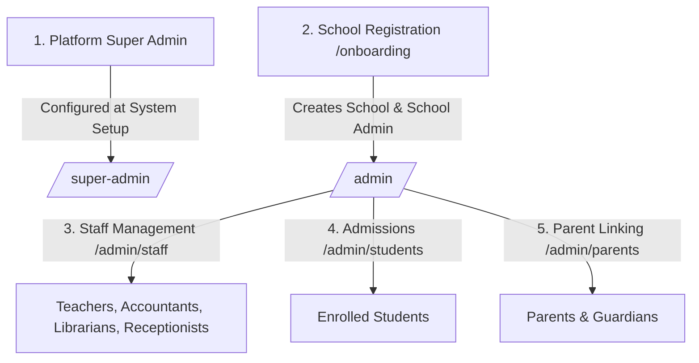

# SchoolOS Real Account Creation & Login Guide

This guide details how every user role is provisioned and authenticated in **SchoolOS**, the operational lifecycle for creating institutional accounts, supported login identifiers, password initialization procedures, and role-to-portal routing.

---

## 1. Universal Login Overview

SchoolOS provides a single, unified login entry point for all users regardless of role:

- **Web Login Portal**: [`/login`](http://localhost:3000/login)
- **API Authentication Endpoint**: `POST /api/auth/login`
- **Session Architecture**: Secure, signed HTTP-only cookie (`schoolos_session`) carrying user ID, role key, school tenant context, and password expiration status.

### Supported Login Identifiers
Users can enter any of the following identifier formats into the single **Login Identifier** field:

| Identifier Type | Real-World Format Examples | Primarily Used By |
| :--- | :--- | :--- |
| **Email Address** | `superadmin@schoolos.app`<br>`adelakunabdulsalam001@gmail.com`<br>`albert.smith@school.edu` | Super Admin, School Admin, Teachers, Staff |
| **Mobile / Phone Number** | `09042427548`<br>`09042427549`<br>`+2348000000001` | Parents, School Admin, Staff, Drivers |
| **Registration / ID Number** | `PHEN/2026/001` (Student Admission No)<br>`PHEN/REC/001` (Staff ID)<br>`SA-001` (Platform ID) | Students, Staff, Super Admin |

The system automatically detects whether the input is an email address, phone number, or registration code using strict pattern matching (`resolveIdentifier`), eliminating the need for users to choose an identifier type.

---

## 2. How Accounts Are Created (Role Lifecycle)

SchoolOS is a multi-tenant platform where accounts are generated through legitimate operational workflows rather than mock seed scripts.



### 1. Platform Super Admin (`super_admin`)
- **How It Is Created**: Initialized during platform deployment. Operates at the root platform level without being bound to a single school (`school_id = null`).
- **Administrative Scope**: Global platform governance across all registered schools, subscription billing, system health, and school activations/suspensions.
- **Destination Portal**: [`/super-admin`](http://localhost:3000/super-admin)

### 2. School Admin (`school_admin`)
- **How It Is Created**: Self-service registration via the School Onboarding wizard at [`/onboarding`](http://localhost:3000/onboarding):
  1. **Step 1 (School Details)**: Enters School Name, Short Code (e.g. `PHEN`), Official Email, Phone Number, and Operating Days.
  2. **Step 2 (Admin Profile)**: Enters Principal/Admin Name, Administrator Email, Mobile Number, and Secure Password.
  3. **Atomic Setup**: SchoolOS generates the school tenant, binds the administrator, seeds academic terms, class standards, and initializes core modules.
- **Administrative Scope**: Full institutional control over the school's staff, students, fees, timetable, attendance, exams, and settings.
- **Destination Portal**: [`/admin`](http://localhost:3000/admin)

### 3. Sub-School Admin (`sub_school_admin`)
- **How It Is Created**: Appointed by the School Admin from existing staff members in **Admin Portal → Staff Management → Sub-Admin Permissions** (`/admin/staff/permissions`).
- **Administrative Scope**: Delegated access to specific administrative modules (e.g. `manage_fees`, `manage_attendance`, `manage_exams`, `enroll_student_faces`).
- **Destination Portal**: [`/admin`](http://localhost:3000/admin)

### 4. Teachers & Staff (`teacher`, `accountant`, `librarian`, `receptionist`, `staff`)
- **How They Are Created**: Provisioned by the School Admin in **Admin Portal → Staff Directory** (`/admin/staff`):
  1. Admin taps **Add Staff Member** (`POST /api/admin/staff`).
  2. Enters full name, role (`Teacher`, `Accountant`, `Librarian`, `Receptionist`, `General Staff`), and email or mobile number.
  3. The system provisions the account with the system default password `12345678` and flags `must_change_password: true`.
- **Destination Portals**:
  - **Teachers**: [`/teacher`](http://localhost:3000/teacher)
  - **Accountants, Librarians, Receptionists, Staff**: [`/staff`](http://localhost:3000/staff)

### 5. Students (`student`)
- **How They Are Created**: Two institutional pathways:
  - **Direct Enrollment**: School Admin registers the student in **Admin Portal → Student Directory** (`/admin/students`), assigning Class Section (e.g. `JSS 1 A`), Roll Number, and personal or guardian contact information.
  - **Public Admissions**: Prospective parents apply online at `/admissions?school=<short_code>`. Upon review and acceptance by the School Admin in `/admin/admissions`, the applicant is automatically converted into an enrolled student user.
- **Student Identifier**: Assigned official Admission / Registration Number (e.g. `PHEN/2026/001`).
- **Destination Portal**: [`/student`](http://localhost:3000/student)

### 6. Parents & Guardians (`parent`)
- **How They Are Created**:
  - **Parent Invitation / Activation**: Admin sends an invitation from `/admin/parents`. The guardian receives an activation link (`/activate?token=...`), sets their preferred password, and confirms their personal details.
  - **Direct Student-Parent Linkage**: Enrolled students are linked to guardians via `POST /api/admin/parent-links` using guardian phone number or email.
- **Parent Identifier**: Registered Mobile Phone Number (e.g. `09042427549`) or Email.
- **Destination Portal**: [`/parent`](http://localhost:3000/parent) (includes multi-child switcher).

---

## 3. Real Accounts Matrix

Below is the directory of real, active accounts configured on the platform and within **phenomenal school** (Tenant Code: `PHEN`, School ID: 5):

| Role Key | Name | Login Email | Login Phone / Mobile | Admission / Reg ID | Default / Initial Password | Destination Portal |
| :--- | :--- | :--- | :--- | :--- | :--- | :--- |
| **`super_admin`** | Platform Super Admin | `superadmin@schoolos.app` | `+2348000000001` | `SA-001` | `Admin@SchoolOS2026!` | [`/super-admin`](http://localhost:3000/super-admin) |
| **`school_admin`** | Mr. Adelakun | `adelakunabdulsalam001@gmail.com` | `09042427548` | — | *(Set during onboarding)* | [`/admin`](http://localhost:3000/admin) |
| **`teacher`** | Abdulsalam | `adelakunabdulsalam123@gmail.com` | `+2348070000000` | — | `12345678` | [`/teacher`](http://localhost:3000/teacher) |
| **`teacher`** | Albert Smith | `albert.smith@school.edu` | `+2348030000000` | — | `12345678` | [`/teacher`](http://localhost:3000/teacher) |
| **`teacher`** | Zainab | `zainab@gmail.com` | — | — | `12345678` | [`/teacher`](http://localhost:3000/teacher) |
| **`accountant`** | Beatrice Lawson | `beatrice.l@school.edu` | `+2348040000000` | — | `12345678` | [`/staff`](http://localhost:3000/staff) |
| **`librarian`** | Samuel Adebayo | `samuel.a@school.edu` | `+2348060000000` | — | `12345678` | [`/staff`](http://localhost:3000/staff) |
| **`receptionist`**| Fatima Bello | `receptionist@phenomenalschool.com` | `09055551234` | `PHEN/REC/001` | `12345678` | [`/staff`](http://localhost:3000/staff) |
| **`student`** | Tunde Adelakun | `tunde.adelakun@phenomenalschool.com` | — | `PHEN/2026/001` | `12345678` | [`/student`](http://localhost:3000/student) |
| **`parent`** | Mrs. Adelakun | `mrs.adelakun@gmail.com` | `09042427549` | `PHEN/PAR/001` | `12345678` | [`/parent`](http://localhost:3000/parent) |

> [!TIP]
> **Flexible Login Identifiers**: You can log in using either the **Email**, the **Mobile Number**, or the **Registration ID** as the identifier. For example:
> - Entering `PHEN/2026/001` with `12345678` logs directly into the Student Portal.
> - Entering `09042427549` with `12345678` logs directly into the Parent Portal.
> - Entering `adelakunabdulsalam001@gmail.com` logs directly into the School Admin Portal.

---

## 4. First-Time Login & Password Change Lifecycle

When staff, students, or parents are newly added to the school:

1. **Default Password Assignment**:
   - Accounts created via staff addition or student registration are provisioned with the standard initial password: **`12345678`**.
   - Database attribute `must_change_password` is initialized to `true`.

2. **First Login & Automatic Interception**:
   - The user navigates to [`/login`](http://localhost:3000/login) and signs in with their identifier and `12345678`.
   - The system validates credentials, authenticates the session, and detects the `must_change_password = true` requirement.

3. **Forced Redirect to `/change-password`**:
   - Navigation to protected portal dashboards (`/teacher`, `/student`, `/staff`, etc.) is intercepted.
   - The user is routed to:
     ```
     /change-password
     ```

4. **Updating to a Personal Password**:
   - The user enters the temporary password (`12345678`) followed by their new password.
   - **Validation Criteria**:
     - Must be at least 8 characters.
     - Cannot be the default password (`12345678`).
   - Upon successful update, `must_change_password` is set to `false`, and the user is redirected to their designated portal dashboard.

5. **Administrative Password Resets**:
   - If a staff member, student, or parent forgets their credentials, the School Admin can reset their password with one click in **Admin Portal → Parents** or **Admin Portal → Staff**.
   - The password reverts to `12345678` and `must_change_password` is re-enabled.

---

## 5. Portal Features by Role

### 1. Super Admin Portal (`/super-admin`)
- Platform-wide school registry and active tenant tracking
- Institution license extension, trial duration, and subscription management
- Emergency school suspension and reactivation controls
- Global platform health diagnostics and background task monitor

### 2. School Admin Portal (`/admin`)
- Comprehensive staff management and sub-admin role delegation
- Academic structure: standards (grades), sections, subjects, and terms
- Student admissions, enrollments, and parent-student relationship mapping
- Fee schedule definition, Paystack online payment tracking, and bursary reconciliations
- Campus GPS coordinates and geofence radius configuration for mobile attendance
- Biometric facial registration approval and student identity card generation

### 3. Teacher Portal (`/teacher`)
- **Daily Check-In**: GPS geofenced facial recognition check-in with liveness detection
- **Class Attendance**: Interactive roll-call register or automated facial recognition scanning
- **Punctuality & Arrivals**: Personal arrival audit trail and late explanation submissions
- **Continuous Assessment & Exams**: Mark recording and score sheet submission
- **Curriculum Library**: Course material uploads and scheme-of-work tracking
- **Biometric Enrollment**: Teacher face template registration (`/teacher/face-registration`)

### 4. Student Portal (`/student`)
- Daily class schedule and subject timetable
- Attendance history and term attendance percentage
- Published terminal examination report cards with subject grades and teacher remarks
- Assignment submissions and download of teacher-provided learning materials
- Outstanding fee balance overview and payment transaction receipts

### 5. Parent Portal (`/parent`)
- **Multi-Child Dashboard**: Seamless switching between multiple children enrolled in the school
- **Live Attendance Feed**: Real-time arrival, departure, and absence notifications
- **Paystack Fee Payment**: Online fee settlement with instant PDF receipt generation
- **Academic Progress**: Terminal report card viewing and progress tracking

### 6. Staff Portal (`/staff`)
- **Accountant**: Fee collection ledger, offline payment recording, invoice reconciliation
- **Librarian**: Book catalog management, ISBN indexing, loan issuing and return ledgers
- **Receptionist**: Visitor logging, sign-ins, and front-desk dispatch
- **General Staff**: Daily GPS check-in, leave application requests, announcements

---

## 6. Security, Isolation & Tenant Guardrails

1. **Multi-Tenant Scoping**:
   - Every database query for school data is strictly scoped by `school_id`. Users from one school cannot view or manipulate records of another institution.
   - Super Admin is the only cross-tenant role (`school_id = null`).

2. **School Status Protection**:
   - If an institution is marked `suspended` or its trial expires, all affiliated staff, students, and parents are locked out with HTTP 403.

3. **Rate Limiting Guard**:
   - Authentication endpoints enforce brute-force protection: accounts are temporarily locked for 15 minutes after 5 consecutive failed login attempts.
